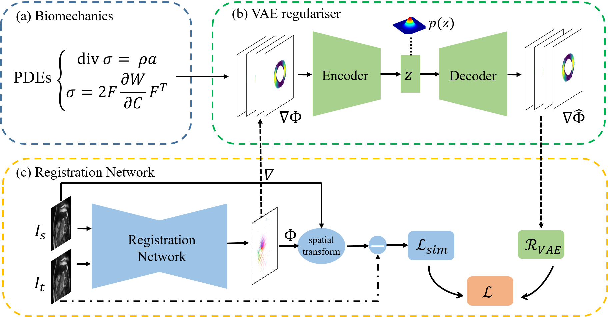

# Biomechanics-informed Neural Networks for Myocardial Motion Tracking in MRI

Code accompanying MICCAI'20 paper of the same title. Paper link: https://arxiv.org/abs/2006.04725

This code is also complementary to https://github.com/cq615/Joint-Motion-Estimation-and-Segmentation

## Introduction

Image registration is an ill-posed inverse problem which often requires regularisation on the solution space. In contrast to most of the current approaches which impose explicit regularisation terms such as smoothness, in this project we propose to implicitly learn biomechanics-informed regularisation. Such an approach can incorporate application-specific prior knowledge into deep learning based registration. Particularly, the proposed biomechanics-informed regularisation leverages a variational autoencoder (VAE) to learn a manifold for biomechanically plausible deformations and to implicitly capture their underlying properties via reconstructing biomechanical simulations. The learnt VAE regulariser then can be coupled with any deep learning based registration network to regularise the solution space to be biomechanically plausible. The proposed method is validated in the context of myocardial motion tracking.

## Usage

## Citation and Acknowledgement
If you use the code for your work, or if you found the code useful, please cite the following works:

Qin, C., Wang, S., Chen, C., Qiu, H., Bai, W., and Rueckert, D. (2020). Biomechanics-informed Neural Networks for Myocardial Motion Tracking in MRI. In International Conference on Medical Image Computing and Computer-Assisted Intervention (MICCAI).

Qin, C., Bai, W., Schlemper, J., Petersen, S.E., Piechnik, S.K., Neubauer, S. and Rueckert, D. Joint learning of motion estimation and segmentation for cardiac MR image sequences. In International Conference on Medical Image Computing and Computer-Assisted Intervention (MICCAI), 2018: 472-480.
